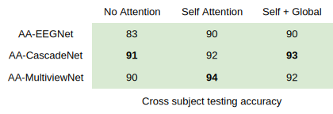

📡 Deep brain state classification of MEG data
========

This project aims to perform cross-subject multi-class classification based on MEG signals to infer the subject's state. The implemented models are AA-CascadeNet, AA-MultiviewNet and AA-EEGNet, all of which incorporates both self and global attention mechanisms. The original paper can be found at: https://arxiv.org/pdf/2007.00897.pdf

📊 Results
-----

The best results for cross-subject testing of models that are trained with 12 subjects and tested on 6 subjects are shown below. 

💻 Installation
-----

The required modules can be installed  via:

.. code:: bash

    pip install -r requirements.txt

Quick Start
~~~~~~~~~~~
To train the AA-MultiviewNet or the AA-CascadeNet:

.. code:: bash

    cd AA-CascadeNet_AA-MultiviewNet
    python Training.py --model cascade --setup 2 --attention no --epochs 10 --depth 100

.. code::

    usage: Training.py [-h] [-s SETUP] [-m MODEL {cascade,multiview}] 
                       [-a ATTENTION {no,self,global}] [-e EPOCHS] [-d DEPTH]
                       
    list of arguments:
    -h, --help             show this help message and exit
    -s, --setup            Please select a number between 0 and 2 to choose the setup of the training (default = 0)
    -m, --model            Please choose the type of model you want to train (cascade or multiview)
    -a, --attention        Please choose the type of attention. Is it no attention, or
                           self-attention only, or self + global attention
    -e, --epochs           Please choose the number of epochs, by default 1 epoch
    -d, --depth            Please choose the depth of the input tensors, by default 10
    
To test the pretrained best configurations (no attention, self-attention, self + global attention):

.. code:: bash
    
    python Testing.py -a self

.. code::

    usage: Testing.py [-h] [-a ATTENTION {no,self,global}] 
    
    list of arguments:
    -h, --help             show this help message and exit
    -a, --attention        Please choose which type of model to load : no attention, self-attention only (self), or 
                           self + global attention (global), by default self attention
                           
To train the AA-EEGNet:

.. code:: bash

    cd AA-EEGNet
    
.. code:: bash
    
    python Train.py

To test the AA-EEGNet with a pretrained model:

.. code:: bash
    
    python Test.py

Note 1: The training file in AA-CascadeNet_AA-MultiviewNet folder uses multiprocessing to load the data, and the number of workers set for training/validation/testing might not be the most optimal one for your computer.

Note 2: It is not advised to run the code in Jupyter notebook environments since the multiprocessing does not interact properly with those environments.

  
📂 Data
-----

In order to download the data, please email to both of the following addresses:

i.alaouiabdellaoui@student.maastrichtuniversity.nl

siamak.mehrkanoon@maastrichtuniversity.nl

The data must be downloaded and unzipped in the same directory as the scripts.

📜 Scripts
-----

- The scripts contain the models, the data preprocessing, as well as the training and testing files.

- The training script trains the model with the subjects in the train/validate folders and saves the intermediate models and weights.

- The test script loads the pretrained model and evaluate it with the indicated subjects.

Additionally, within the AA-EGGNet directory, a script to download and preprocess the subjects directly from the HCP source can be found (in case the user wants to use different patients). This script needs your own personal access key ID and secret access key from Amazon services.

🔗 Citation
-----

If you decide to cite our project in your paper or use our data, please use the following bibtex reference:

.. code:: bibtex

    @misc{abdellaoui2020deep,
        title={Deep brain state classification of MEG data},
        author={Ismail Alaoui Abdellaoui and Jesús García Fernández and Caner Şahinli and Siamak Mehrkanoon},
        year={2020},
        eprint={2007.00897},
        archivePrefix={arXiv},
        primaryClass={cs.LG}
    }
